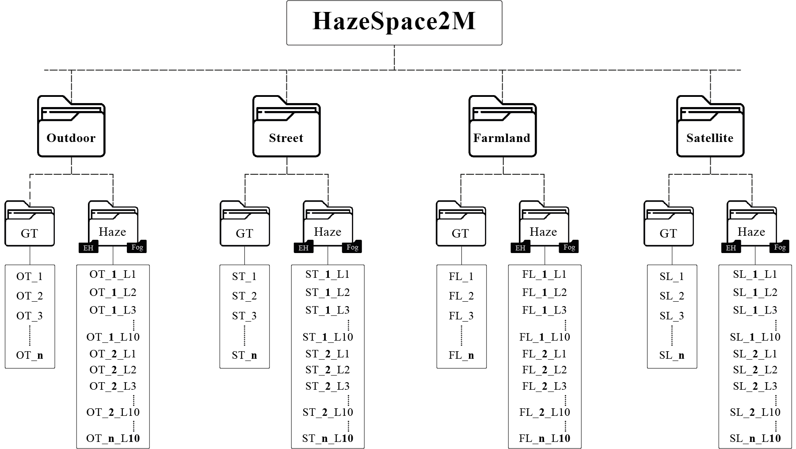

<h2 align="center"><strong><a href="https://2024.acmmm.org/">Accepted in ACM MM'24, Sydney, Australia</a></strong></h2>
<h1 align="center"><strong>HazeSpace2M: A Dataset for Haze Aware Single Image Dehazing <a href="https://tanvirnwu.github.io/assets/papers/HazeSpace2M.pdf" target="_blank">[Download]</a></strong></h1>


<h4 align="center">Md Tanvir Islam<sup> 1</sup>, Nasir Rahim<sup> 1</sup>, Saeed Anwar<sup> 2</sup>, Muhammad Saqib<sup> 3</sup>, Sambit Bakshi<sup> 4</sup>, Khan Muhammad<sup> 1, *</sup></h4>
<h4 align="center">| 1. Sungkyunkwan University, South Korea | 2. KFUPM, KSA | 3. UTS, Australia | 4. NIT Rourkela, India |</h4> 
<h4 align="center">| *Corresponding Author |</h4> <br>

----------
## HazeSpace2M Dataset

## Haze Aware Dehazing


## Dependencies
```
pip install -r requirements.txt
````

## Dataset Download
We are preparing the complete dataset formatting with a structural naming convention. We will upload the full dataset as soon as we complete preparing the dataset with correct naming format as we displayed in the last images in this page. 
<!--The subsets of the HazeSpace2M dataset are available for download from the following links:
1. **Kaggle:** Outdoor | 2. Street | 3. Farmland | 4. Satellite 
2. **TeraBox:** Outdoor | 2. Street | 3. Farmland | 4. Satellite -->


## Pretrained Weights
We will upload the pre-trained weights very soon.
<!--All the pre-trained weights of the classifiers and the dehazers are available to download:
<br>
DropBox: | [**Classifier**](https://www.dropbox.com/scl/fo/8yq89dwtzi5oz46m394vt/AFdoA362cTL8-lLLxoITo9w?rlkey=brfwcbcnv4y627elmz21i626w&st=3vaoml2m&dl=0) | [**Specialized Dehazers**](https://www.dropbox.com/scl/fo/kc6lnv7gbov0npu2obp4n/AD5zNVhki2x3GH9HA5Lwbqk?rlkey=jzpunuzrkb0a44hh1x1fu44yi&st=7gb5qb67&dl=0) |
-->
## Testing
```
python inference.py --gt_folder <path_to_gt> --hazy_folder <path_to_hazy> --output_dir <output_dir> --classifier <path_to_classifier> --cloudSD <path_to_cloudSD> --ehSD <path_to_ehSD> --fogSD <path_to_fogSD>

````
_**Note:** Each variable is explained in the inference.py file._


## Use Own Classifiers
**To use your custom classifier, please follow the following steps:**
1. Write the code for your classifier architecture in the _**classifier.py**_ file in the _models_ folder.
2. Now define the object of your classifier in the _**classification_inference**_ method inside the _conditionalDehazing.py_ file under the _models_ folder.
3. Finally, define the weights of your classifier inside the _**inference.py**_ file
   
**To use your custom specialized dehazers, please follow the following steps:**
1. Write the code for your classifier architecture in the _**dehazer.py**_ file in the _models_ folder.
2. Now define the object of your dehazer in the _**load_model**_ method inside the _helper.py_ file under the _utils_ folder.
3. Finally, define the weights of your classifier inside the _**inference.py**_ file

## HazeSpace2M Folder Structure



## Cite this Paper

If you find our work useful in your research, please consider citing our paper:

```bibtex
@article{islam2024hazespace2m,
  title={HazeSpace2M: A Dataset for Haze Aware Single Image Dehazing},
  author={Islam, Md Tanvir and Rahim, Nasir and Anwar, Saeed and Saqib, Muhammad and Bakshi, Sambit and Muhammad, Khan},
  journal={arXiv preprint arXiv:2409.17432},
  year={2024}
}

@inproceedings{hazespace2m,
  title={HazeSpace2M: A Dataset for Haze Aware Single Image Dehazing},
  author={Islam, Md Tanvir and Rahim, Nasir and Anwar, Saeed and Saqib Muhammad and Bakshi, Sambit and Muhammad, Khan},
  booktitle={Proceedings of the 32nd ACM International Conference on Multimedia},
  year={2024},
  doi = {10.1145/3664647.3681382}
}
